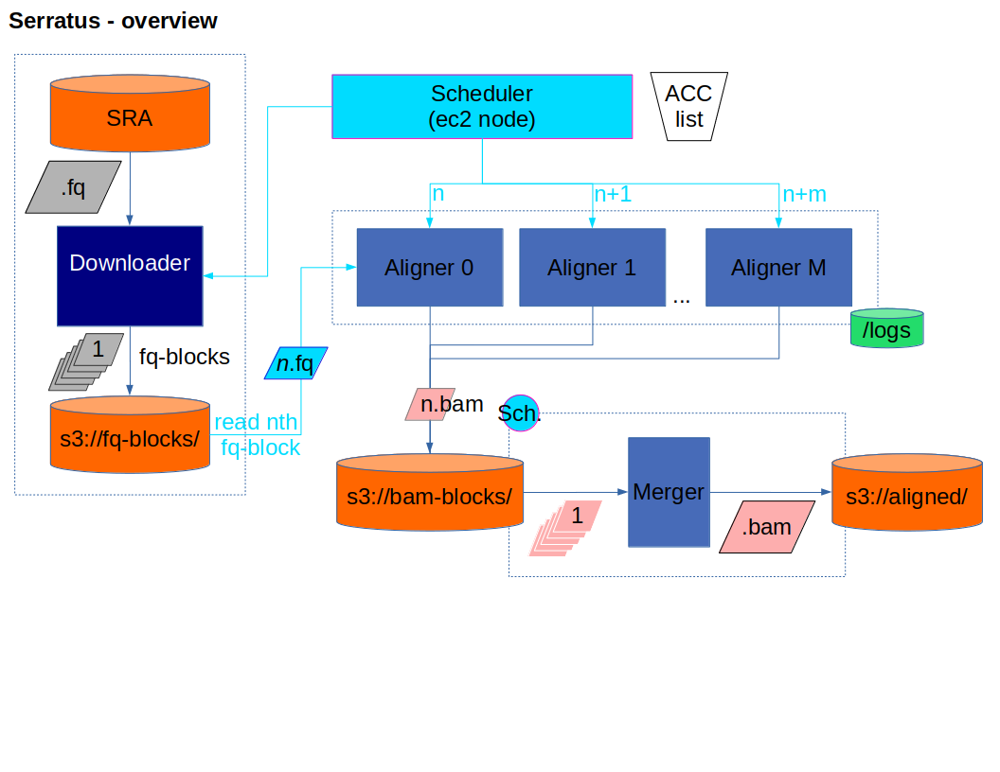

# serratus

### Background
The SARS-CoV-2 pandemic will infect millions and has already crippled the global economy. 

While there is an intense research effort to sequence SARS-CoV-2 isolates to understand the evolution of the virus in real-time, our understanding of where it originated is limited by the sparse characterization of other members of the Coronaviridae family (only 53/436 CoV sp. Genomes are available).
 
We are re-analyzing all RNA-sequencing data in the NCBI Short Read Archive to discover new members of Coronaviridae. Our initial focus is mammalian RNA-sequencing libraries followed by avian/vertebrate, metagenomic, and finally all 1.12M entries (5.72 petabytes).

### Architecture

## Repository organization

`data/README.md`: README.md outlining location/acquisition of serratus data

`docker/`: Container make files and tokens

`img/`: Architecture/workflow diagrams

`packer/`: Standardized node images (ami)

`scheduler/`: Code for `serratus` head-node and sraRunInfo management

`scripts/`: Defined units of work performed in `serratus`

`terraform/`: Cloud resources / pipeline management

## Useful links
- **S3 Bucket:** s3://serratus-public/ (public-readable)

#### AWS-specific
- [AWS Batch workflow - Introduction](https://aws.amazon.com/blogs/compute/building-high-throughput-genomics-batch-workflows-on-aws-introduction-part-1-of-4/)
- [AWS Batch workflow - github page](https://github.com/aws-samples/aws-batch-genomics)
- [SRAtoolkit in Cloud Computing](https://www.ncbi.nlm.nih.gov/sra/docs/sra-cloud/)
- [NCBI SRA Data on S3](https://registry.opendata.aws/ncbi-sra/)
- [S3 transfer optimization](https://docs.aws.amazon.com/cli/latest/topic/s3-config.html)
- [Paper on analyzing EC2 costs (2011)](https://journals.plos.org/plosone/article?id=10.1371/journal.pone.0026624)
- [Pushing the limits of Amazon S3 Upload Performance](https://improve.dk/pushing-the-limits-of-amazon-s3-upload-performance/)
- [Clever SRA alignment pipeline](https://github.com/FredHutch/sra-pipeline
)

#### SARS-CoV-2
- [SARS-CoV-2 UCSC Genome Browser](https://genome.ucsc.edu/cgi-bin/hgTracks?db=wuhCor1)
- [Interpretable detection of novel human viruses from genome sequencing data](https://www.biorxiv.org/content/10.1101/2020.01.29.925354v3.full.pdf)
- [Virus detection from RNA-seq: proof of concept](https://www.ncbi.nlm.nih.gov/pubmed/21603639)

#### Bloom Filters
- [Bigsi: Bloom filter indexing of SRA/ENA for organism search](https://github.com/phelimb/bigsi)
- [Fast Search of Thousands of Short-Read Sequencing Experiments](https://www.ncbi.nlm.nih.gov/pmc/articles/PMC4804353/)
- [Ultra-fast search of all deposited bacterial and viral genomic data](https://www.ncbi.nlm.nih.gov/pmc/articles/PMC6420049/)

# Setting up and running Serratus

### 0) Prerequisite: AWS account

1. Sign up for an AWS account if you don't have one yet. You can use the free basic tier.
2. [Create an IAM Admin User with Access Key](https://docs.aws.amazon.com/IAM/latest/UserGuide/getting-started_create-admin-group.html). For **Access type**, use **Progammatic access**.
3. Note the Access Key ID and Secret values.

Set these as environment variables for the future steps. Run:

    $ export AWS_ACCESS_KEY_ID="your_access_key"
    $ export AWS_SECRET_ACCESS_KEY="your_secret_key"

### 1) Building AMIs with Packer

First, [download Packer](https://packer.io/downloads.html).  It comes as a single binary which you can just unzip.  I extracted it to `~/.local/bin` so that it ended up on my PATH.

Next, use it to build the AMI: `/path/to/packer build serratus/packer/docker-ami.json`

This will start up a t3.nano, build the AMI, and then terminate it.  Currently this takes about 2 minutes, which should cost well under a penny.

###  2) Getting started with Terraform

#### Variables

Before starting, you'll need to [setup a keypair on EC2](https://docs.aws.amazon.com/AWSEC2/latest/UserGuide/ec2-key-pairs.html#having-ec2-create-your-key-pair).  Make sure to use the us-east-1 region, as that's where the SRA data is stored.  Keep the name of the keypair and the `.pem` file, you'll need them later.

You'll also need to find out your public IP.  Try `curl ipecho.net/plain; echo`.

Open terraform/main/terraform.tfvars.  There are three environment variables in this file:

 * `dev_cidrs`: Your public IP, followed by "/32"
 * `key_name`: EC2 key pair name
 * `dockerhub_account`: Where the docker images are stored.  You can leave it as-is if you don't want to build the images.

### 3) Initialization

The top-level module is in serratus/terraform/main.  Change directory to there, run `tf init`, and then `tf apply` to create some infrastructure.

At the time of writing, this will create:

  * a t3.nano, for the scheduler, with an Elastic IP
  * an S3 bucket, to store intermediates
  * an ASG for serratus-dl, using c5.large with 50GB of gp2.
  * An ASG for serratus-align, using c5.large
  * An ASG for serratus-merge, using t3.small
  * Security groups and IAM roles to tie it all together.

All ASGs have a max size of 1.  This can all be reconfigured in terraform/main/main.tf.

At the end of `tf apply`, it will output the scheduler's DNS address.  Keep this for later.

### 4) Creating an SSH Tunnel to the scheduler

By default, the scheduler exposes port 8000.  This port is *not* exposed to the public internet because it doesn't support any authentication or encryption yet.  You'll need to create an SSH tunnel to allow your local web-browser and terminal to connect.  

    $ scheduler_dns=<copied this from terraform>
    $ ssh -i /path/to/key.pem -L 8000:localhost:8000 ec2-user@$scheduler_dns

Leave this terminal open.  It will route requests from port 8000 on your local machine to the application running on the scheduler.

To test this, open a web browser at [http://localhost:8000/jobs/](http://localhost:8000/jobs/). You should some table headings with no actual data.  If so, the scheduler is ready to be loaded. The scheduler takes a few minutes to boot up.  If you're seeing strange errors (eg. connection reset by peer), go make a cup of tea and come back in ten minutes.

### 5) Loading SRA Data

Once the scheduler's up.  Assuming you have an `SraRunInfo.csv` file (NCBI SRA > `Send to: File`), and you've successfully connected, you can load it with curl

    $ curl -s -X POST -T /path/to/SraRunInfo.csv localhost:8000/jobs/add_sra_run_info/

This should respond with a short JSON indicating the number of rows inserted, and the total number in the scheduler.

In your web browser, refresh the status page.  You should now see a list of accessions by state.  If ASGs are online, they should start processing immediately.  In a few seconds, the first entry will switch to "splitting" state, which means it's working.

# Data Release Policy
To achieve our objective of providing high quality CoV sequence data to the global research effort, Serratus ensures:
- All software development is open-source and freely available (GPLv3)
- All sequencing data generated, raw and processed, will be freely available in the public domain in accordance with the [Bermuda Principles](https://en.wikipedia.org/wiki/Bermuda_Principles) of the Human Genome Project.

# Contributing
`Serratus` is an Open-Science project. We welcome all scientists to contribute.
Email (ababaian AT bccrc DOT ca) or join [Slack](https://join.slack.com/t/hackseq-rna/shared_invite/zt-cs2f4dy8-QZ92T8E1O_Lwrse18yXWEA)