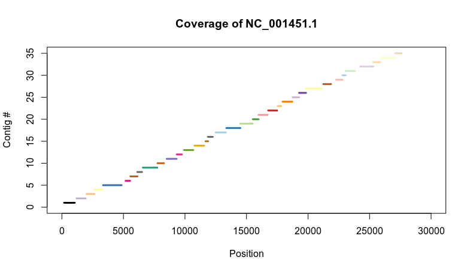

*Date: 2020-05-16*

*Author: Mikael Huss*

## Background

These instructions were posted on issue 71 on [Github](https://github.com/ababaian/serratus/issues/71#issuecomment-626766913):

>I will offer US$250 Amazon gift certificate to first person to implement an open-source method which creates de novo contigs from GroupA: SRR10951654-655 and GroupB: SRR10829951-958. Contigs must be validated against a close known virus reference. Virus reference genomes must not be used as a positive filter before assembly, the key challenge is how to assemble when only a small fragment is recognized.
Offer expires in a week -- contigs and method documentation must be posted before 12pm Pacific time Sunday May 17th.
RCE -- edit to clarify -- You must start from the full SRA dataset, not the BAM file generated by Serratus. In the datasets above, there is a close relative of a known virus, so the BAM files probably include almost all virus reads and very little host. This is easy. The situation we don't know how to handle is where we see reads hitting a short fragment, say one CDS, but not an entire genome. In that case, most of the virus reads will be missing from the Serratus BAM file. Host filtering is allowed (the above datasets have pig hosts, which are a good model for this situation), but filtering by the virus reference is not allowed.

## Results
 
 
For GroupB, with the high coverage, the virus identified was **porcine epidemic diarrhea virus**. I have posted the longest contig, which essentially covers the whole genome, at [this](https://drive.google.com/open?id=1Af3VF4AkbL41BPZ5NJ9VYrWag6q8CRCN) Google Drive location. There were many other contigs as well but I omit those as the one contig is already quite good.
 
For GroupA, with the lower coverage, most viral contigs were from an *avian infectious bronchitis virus*. I have posted 37 contigs that BLASTed to that genome [here](https://drive.google.com/open?id=1GDpCeJyQxKx9lsw2VPtv5e_FvMS5fh4P). These contigs do not fully cover the genome but are found across most of it: 

As this was exploratory work, I did not have time to make a nice Nextflow or Snakemake workflow, so I will just give the individual steps below.

## Rough outline of *de novo* assembly pipeline

1. Concatenate all the reads
2. Read trimming 
3. Filter out host sequences
4. Filter out low-complexity reads
5. Merge overlapping reads if applicable
6. Assemble with Megahit (or Spades/IDBA-UD)
7. (Not really part of the assembly) BLAST contigs against viral Refseq reference

## More details of *de novo* assembly pipeline

The strategies for the two different groups are slightly different, because group A had only single-end data whereas group B consisted of paired-end data. 

Assume that the following software is installed under paths stored in the respective bash variable:

* Bowtie2 - $BOWTIE_PATH 
* Trim Galore - $TRIMGALORE_PATH
* Flash - $FLASH_PATH
* Prinseq - $PRINSEQ_PATH
* Megahit - $MEGAHIT_PATH
* BLAST - $BLAST_PATH

### Step 1: Concatenate reads

(Assuming we are standing in a directory containing only the fastq.gz files we are interested in for the moment)

`cat *.fastq.gz > exp1.fastq.gz` (for single-end)

`cat *_1.fastq.gz > exp2_1.fastq.gz; cat *_2.fastq.gz > exp2_2.fastq.gz` (for paired-end)

### Step 2: Read trimming

Trim Galore (a wrapper around CutAdapt) is used for adapter removal and quality trimming. Of course, the parameter values can be debated.

`$TRIMGALORE_PATH/trim_galore -q 28 --stringency 5 exp1.fastq.gz 2> trim.err` (single-end)

`$TRIMGALORE_PATH/trim_galore --paired -q 28 --stringency 5 exp2_1.fastq.gz exp2_2.fastq.gz 2> trim.err` (paired-end)

The output files will have names like `exp1_trimmed.fq.gz` (single end) or `exp2_1_val_1.fq.gz` and `exp2_2_val_2.fq.gz` (paired end; the “val” stands for “validated”).

### Step 3: Filtering out host sequences

This is actually several steps. In this case we knew the hosts were pigs, so I built bowtie2 indexes for cDNA and DNA after downloading those from ENSEMBL.

`$BOWTIE_PATH/bowtie2-build Sus_scrofa.Sscrofa11.1.cdna.all.fa pig_cdna`

`$BOWTIE_PATH/bowtie2-build Sus_scrofa.Sscrofa11.1.dna.toplevel.fa`

Now bowtie2 can be used to retain only reads that do not map to those references. Again, exact parameter values can of course be debated. 

#### Map away pig DNA/cDNA (single end)

`$BOWTIE_PATH/bowtie2 -p 4 --un-gz exp1_post_dna.fq.gz -x ../hosts/pig_dna -U exp1_trimmed.fq.gz > /dev/null 2> exp1_dna_bowtie_stats.txt`

`$BOWTIE_PATH/bowtie2 -p 4 --un-gz exp1_post_cdna.fq.gz -x ../hosts/pig_cdna -U exp1_post_dna.fq.gz > /dev/null 2> exp1_dna_bowtie_stats.txt`

#### Map away pig DNA/cDNA (paired end)

`$BOWTIE_PATH/bowtie2 -p 4 --un-conc-gz exp2_post_dna.fq.gz -x ../hosts/pig_dna -1 exp2_1_val_1.fq.gz -2 exp2_2_val_2.fq.gz > /dev/null 2> exp2_dna_bowtie_stats.txt`

`$BOWTIE_PATH/bowtie2 -p 4 --un-conc-gz exp2_post_cdna.fq.gz -x ../hosts/pig_cdna -1 exp2_post_dna_1.fq.gz -2 exp2_2_post_dna_2.fq.gz > /dev/null 2> exp2_cdna_bowtie_stats.txt`

### Step 4: Filtering out low-complexity reads

Sometimes it can be useful to filter out low-complexity reads. An example of such reads is reads containing poly-A tails, which will be hard to map.

(unzip the fastq.gz files; unfortunately I think prinseq needs it)

#### Single end:

`perl $PRINSEQ_PATH/prinseq-lite.pl -fastq exp1_post_cdna.fq -lc_method entropy -lc_threshold 50 -out_good exp1_post_step4.fq -out_bad null`

#### Paired end:

`perl $PRINSEQ_PATH/prinseq-lite.pl -fastq exp2_post_cdna.fq.1 -fastq2 exp2_post_cdna.fq.2 -lc_method entropy -lc_threshold 50 -out_good exp2_post_step4.fq -out_bad null`

**Note:** In the two runs that were donw here, this filter didn’t actually do much, so this step was probably not that important.

### Step 5: Merging overlapping reads

This step is only applicable to paired-end libraries. It’s about trying to figure out which read pairs are actually overlapping, so that the separate reads can be joined into a single longer read, which will be good for assembly.

I guessed a bit regarding these parameters, as the metadata on SRA was not sufficient. The mean fragment length seems to have been 300 nt (the metadata has that value) but the standard deviation is not given, so I followed the FLASH manual in assuming 10%, i.e. 30 nt.
 
`$FLASH_PATH/flash -r 150 -f 300 -s 30 -o exp2_post_step5 -z exp2_post_step4.fq_1.fastq exp2_post_step4.fq_2.fastq`

### Step 6: Assembly

I tried SPAdes, IDBA-UD and Megahit. As I was doing this on my laptop (16 GB RAM), only Megahit was able to handle Group B, whereas all of them ran on Group A. All three assemblers gave roughly similar results on Group A (similar number of contigs mapping to the avian coronavirus, similar length distribution of contigs etc.)

#### Megahit for single-end reads

`$MEGAHIT_PATH/megahit -r exp1_post_step4.fastq.gz`

#### Megahit for paired end + merged reads

`$MEGAHIT_PATH/megahit -1 exp2_post_step5.notCombined_1.fastq.gz -2 exp2_post_step5.notCombined_2.fastq.gz -r exp2_post_step5.extendedFrags.fastq.gz`

Megahit will produce a file called `final.contigs.fa.`

#### (Step 7: BLAST to references)

This is not really part of assembly anymore, but of course one will want to see what the contigs might be. I indexed the RefSeq viral nucleotide and protein sequences from here and mapped the Megahit contigs with blastx or blastn, e.g.

`$BLAST_PATH/blastx -db viral_refseq_proteins -query final.contigs.fa -outfmt '6 qseqid sseqid evalue sstart send' > exp2_megahit_refseq_vir.txt`

Then there was some trivial scripting involved to map each accession code to a human-readable organism name via [this table](https://www.ncbi.nlm.nih.gov/genomes/GenomesGroup.cgi?taxid=10239&cmd=download2), but I will omit that for now.

I then used a Jupyter notebook to investigate the BLAST hits and identify the organisms that were most well-represented among the contig BLAST hits. A simple R script was used to plot the alignment locations on a selected reference genome. 
