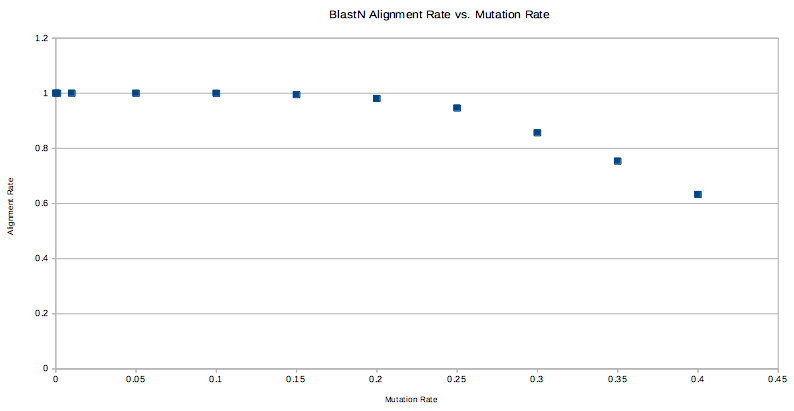

# Introduction

This folder contains various experiments related to how to search
prospective SRA runs quickly to determine whether there is CoV-related
reads which warrant more detailed analysis.

## SRA BlastN_

A poorly-documented feature of the `sra-toolkit` is a program called
`blastn_vdb`. It is a binary that allows the NCBI Blast suite
subroutines to access sequence data in SRA-formatted files directly,
without a need to first use a tool like `fastq-dump` to export the
data to a flat-file format. This provides immediate savings in
processing time if the search itself doesn't eat up those savings.

### Methodology

I sought to evaluate the performance of using `blastn_vdb` both in
terms of resource utilization (i.e., CPUs, RAM, etc.) and
sensitivity. I repurposed some simulated reads that Artem had used in
the past to evaluate the fitness of using Bowtie2 for detecting
reads from divergent Coronavirus genomes:

`https://github.com/ababaian/serratus/blob/master/notebook/200411_CoV_Divergence_Simulations.ipynb`

#### Testing Sensitivity

I wanted to reuse Artem's testing set-up, so I had to use `blastn`
from the NCBI Blast package instead of testing `blastn_vdb` directly,
as it can only work on SRA files. The code that does the hit search
and alignment should be exactly the same, so it is used here as a
proxy.

Download & set up some required software:

```shell
mkdir -p third-party
cd third-party
wget https://ftp.ncbi.nlm.nih.gov/blast/executables/blast+/LATEST/ncbi-blast-2.10.0+-x64-linux.tar.gz
tar xzf ncbi-blast-2.10.0+-x64-linux.tar.gz
export PATH=$PATH:$PWD/third-party/ncbi-blast-2.10.0+/bin
conda install -c bioconda bowtie2
```

First, we fetch the benchmark simulated reads:
```shell
mkdir -p benchmark
time aws s3 sync s3://serratus-public/notebook/200411/fq fq
cd fq
for file in `ls *.gz`; do gunzip $file; done
```

Next, we build Blast DBs for each one:
```shell
cd benchmark/fq
MU=(0 30 300 1500 3000 4500 6000 7500 9000 10500 12000)
for mu in ${MU[@]}
do
	mkdir -p sim.cov.${mu}
	pushd sim.cov.${mu}
	cat <(sed -n '1~4s/^@/>/p;2~4p' ../sim.cov.${mu}_1.fq) \
	    <(sed -n '1~4s/^@/>/p;2~4p' ../sim.cov.${mu}_2.fq) \
	    > sim.cov.${mu}.fasta
	makeblastdb -dbtype nucl -in sim.cov.${mu}.fasta
	popd
done	
```

Finally, we run `blastn` with the SARS-CoV-2 reference genome
`NC_045512.2` as the query, and the indexed reads as the subject
(database), mirroring the orientation used by `blastn_vdb`:

```shell
cd benchmark
mkdir -p blastn-output
## 
MU=(0 30 300 1500 3000 4500 6000 7500 9000 10500 12000)
rm -f blastn-output/alignment-rate.txt
touch blastn-output/alignment-rate.txt
for mu in ${MU[@]}
do
        time blastn \
            -db fq/sim.cov.${mu}/sim.cov.${mu}.fasta \
            -query ../SARS-CoV-2.fa \
            -out blastn-output/sim.cov.${mu}.tsv \
            -evalue 0.001 \
            -max_target_seqs 100000 \
            -task blastn \
            -outfmt "7 std qlen slen"
    awk -v tot="`egrep -c "^>" fq/sim.cov.${mu}/sim.cov.${mu}.fasta`" \
    	'!/^#/ && !a[$2]++ { count++}END{print count/tot}' \
	blastn-output/sim.cov.${mu}.tsv \
	>> blastn-output/alignment-rate.txt
done
```

In theory, an aligner that suffered no loss in sensitivity in the face
of increased sequence divergence would not need more than a single
Coronavirus genome as a reference. Of course in reality all tools have
diminished sensitivity, so one way to compensate is to stock the
reference database with a diverse collection of Coronavirus
genomes. To gauge the degree of improvement of the alignment rate when
going from a single genome to a large reference database, I used
Bowtie2 to align the reads simulated at a 40% mutation rate against
the `cov3ma` reference.

```shell
aws s3 cp s3://serratus-public/seq/cov3ma/cov3ma.fa .
date; time bowtie2-build cov3ma.fa cov.index; echo $?; date
time bowtie2 --very-sensitive-local \
      -x cov.index -1 benchmark/fq/sim.cov.12000_1.fq -2 benchmark/fq/sim.cov.12000_2.fq  \
      | samtools view -b -G 12 -) \
      1> sim.cov.12000.bam \
      2> runtime.bt2.12000
```

I performed additional analysis of "false positives" using a list of
CoV+ SRA runs, and a set of SRA runs that are thought to be CoV-free
(but this cannot be guaranteed). The files can be found here:

```
s3://serratus-public/notebook/200518_ta_blastx-reads/cov_pos_sras.txt
s3://serratus-public/notebook/200518_ta_blastx-reads/cov_neg_sras.txt
```

Setting up the workspace and staging the files:

```
sudo mkdir -p /media/storage
sudo mkfs.ext4 /dev/nvme0n1
sudo mount /dev/nvme0n1 /media/storage
sudo chmod -R 777 /media/storage
mkdir -p /media/storage/workdir
cd /media/storage/workdir
mkdir pos
cd pos
time prefetch --progress `awk '!/^#/ { print $1 }' ~/repos/serratus/notebook/200518_ta_blastx-reads/cov_pos_sras.txt | tr '\n' ' '`
mkdir ../neg
cd ../neg
time prefetch --progress `awk '!/^#/ { print $1 }' ~/repos/serratus/notebook/200518_ta_blastx-reads/cov_neg_sras.txt | tr '\n' ' '`
mkdir ../asm
cd ../asm
time prefetch --progress `awk '!/^#/ { print $1 }' ~/repos/serratus/notebook/200518_ta_blastx-reads/assembly-benchmark.txt | tr '\n' ' '`
```

Now, we evaluate the negative samples:
```shell
for acc in `ls`
do
	time blastn_vdb \
            -db "$acc" \
            -query ../SARS-CoV-2.fa \
            -out $acc.tsv \
            -evalue 0.001 \
            -max_target_seqs 100000 \
            -task blastn \
            -outfmt "7 std qlen slen"
done
```

#### Testing Performance

I wrote a Snakemake file to automate the testing of `blastn_vdb` (see
`Snakefile` in this directory). I tested its performance against the
Frankie SRA run ('ERR2756788'), a SARS-CoV-2 positive (CoV+) SRA run
('SRR11454614'), and a SARS-CoV-2 negative (CoV-) SRA run
('ERR3568641'), inspired by Robert's benchmarking set-up as found
here:

`https://github.com/ababaian/serratus/blob/54856f0f86ff8f0af3ed6f9e87f0d7d04819c570/notebook/2000605_rce_diamond.pdf`

I also used the same environment set-up to test the performance of
`blastn_vdb` when using more than one SRA at a a time. Below, see the
runtimes for three samples individually, and the runtime for running
three simultaneously:

```shell
time blastn_vdb \
            -db "SRR11454615" \
            -query SARS-CoV-2.fa \
            -out SRR11454615.tsv \
            -evalue 0.001 \
            -max_target_seqs 100000 \
            -task blastn \
            -outfmt "7 std qlen slen"

time blastn_vdb \
            -db "SRR11454610" \
            -query SARS-CoV-2.fa \
            -out SRR11454610.tsv \
            -evalue 0.001 \
            -max_target_seqs 100000 \
            -task blastn \
            -outfmt "7 std qlen slen"

time blastn_vdb \
            -db "SRR11454608" \
            -query SARS-CoV-2.fa \
            -out SRR11454608.tsv \
            -evalue 0.001 \
            -max_target_seqs 100000 \
            -task blastn \
            -outfmt "7 std qlen slen"

time blastn_vdb \
            -db "SRR11454608 SRR11454610" \
            -query SARS-CoV-2.fa \
            -out test2.tsv \
            -evalue 0.001 \
            -max_target_seqs 100000 \
            -task blastn \
            -outfmt "7 std qlen slen"

time blastn_vdb \
            -db "SRR11454608 SRR11454610 SRR11454615" \
            -query SARS-CoV-2.fa \
            -out test3.tsv \
            -evalue 0.001 \
            -max_target_seqs 100000 \
            -task blastn \
            -outfmt "7 std qlen slen"
```

### Results

#### Sensitivity

Here is a table of the alignment rate of `blastn` as a function of the
mutation rate:


Mutation % | Align %
--- | ---
0 | 1
0.001 | 1
0.01 | 1
0.05 | 0.999866
0.1 |  0.999799
0.15 | 0.994983
0.2 |  0.980936
0.25 | 0.946154
0.3 |  0.856455
0.35 | 0.753612
0.4 |  0.632642


Here is a plot of the alignment rate of `blastn` as a function of the
mutation rate:



There was a concern that this approach might have greater sensitivity
at the expense of a greater number of false positives. Artem provided
me with a list of 27 SRA accessions that he asserted would not have
coronavirus DNA present. The following output shows that only a small
number of hits were found, with most of the runs showing no hits at
all.


```
ERR2906838.tsv:1
ERR2906839.tsv:5
ERR2906840.tsv:2
ERR2906842.tsv:2
SRR6639051.tsv:0
SRR6639053.tsv:0
SRR9658356.tsv:1
SRR9658357.tsv:3
SRR9658358.tsv:4
SRR9658359.tsv:3
SRR9658360.tsv:2
SRR9658361.tsv:2
SRR9658362.tsv:0
SRR9658363.tsv:0
SRR9658364.tsv:1
SRR9658365.tsv:1
SRR9658384.tsv:0
SRR9658385.tsv:0
SRR9658386.tsv:0
SRR9658387.tsv:0
SRR9658388.tsv:0
SRR9658389.tsv:0
SRR9658390.tsv:0
SRR9658391.tsv:0
SRR9658392.tsv:0
SRR9658393.tsv:0
SRR9658394.tsv:0
```

By contrast, if you check out the following file:

`s3://serratus-public/notebook/200518_ta_blastx-reads/cov_neg_sras.txt`

The tool used to screen these samples (bowtie2?) generated a much
larger number of false positives: most samples had non-zero entries,
with most of them in the double-digits. 

#### Performance

Running `blastn_vdb` on a pre-fetched SRA file took only one minute
using a single thread, using the SARS-CoV-2 genome as the
"query". The runtime seemed to increase linearly with the size of the
query, so that putting in another SARS-CoV-2 genome would double the
run-time. Memory consumption was proportional to the size of the SRA
files being processed.

Interestingly, `blastn_vdb` scales well when given more than one SRA
sample to process at a time, probably due to on-the-fly index building
happening in-memory. From the set-up described in the Methods section,
here are the runtimes:

Sample(s) | Time
--- | ---
SRR11454608 | 55s
SRR11454610 | 37s
SRR11454615 | 1m 41s
First two | 1m 9s
All three | 1m 33s

In fact, the time taken to process three samples simultaneously was
less than the time to process the longest-running singleton job! This
implies that the way to scale `blastn_vdb` is to batch the number of
samples it processes simultaneously, not try to give it increasingly
long "reference" sequence to compare against. It also only
parallelizes its workflow when there is more than one SRA file as part
of the "db", so further bolstering the case for SRA-parallelization,
not reference DB sequence parallelization.


### Discussion & Future Work

The use of `blastn_vdb` would allow for a significant improvement in
the Serratus pipeline, as Artem reports that there's roughly a 1:10
ratio between the time it takes to pre-fetch an SRA file, and the time
taken to dump out the FASTQ sequence to disk. The sensitivity is
superior to that of Bowtie2: while Bowtie2's alignment rate bottoms
out to near zero at 40% divergence, BlastN is still aligning at 63%.

The only question is about `blastn_vdb`'s ability to handle a larger
reference database as its "query", as currently it wouldn't be
performant taking the entire `cov3ma` database as-is. One of the
drivers for making such an expansive cov3ma database was the rationale
that if Bowtie2's sensitivity dropped off, that we can compensate by
having a greater diversity in the reference database. With BlastN's
superior sensitivity, it might be a wash. Further testing would
determine where the break-even point might be. One thing that would
bear immediate fruit would be to make the cov3ma database
non-redundant, as currently has many copies of complete coronavirus
genomes. An approach like what is taken by `Centrifuge` to remove
redundancy in a genome database would be useful for both Bowtie2 or
BlastN:

`http://genome.cshlp.org/content/early/2016/11/16/gr.210641.116`

Another use of `blastn_vdb` would be as a "predicate", to quickly
determine in one minute whether a given sample is worth dumping out as
FASTQ to disk, and checking more carefully with a larger reference
database. 

It seems that `blastn_vdb` does not parallelize on the "query"
sequences, but rather on the SRA samples. This means that greater
throughput will be achieved by processing multiple SRA files
simultaneously. Even when running single-threaded, there's greater
throughput when running SRA files simultaneously. This limitation on
the query sequences can be circumvented by using GNU Parallel to split
up the reference database of CoV sequences (which, according to
`blastn_vdb`, are the query sequences) , running a single sequence
from the CoV sequences against the SRA file at a time.

Currently only the `blastn` program is available in the SRA toolkit
for aligning against SRA files directly. We can simulate a
`blastx`-like program by, for a specificed translation code, render
each protein sequence in all of the possible translations from peptide
sequence back to nucleotide sequence. Using informative identifiers,
these back-translated sequences can be mapped to the original protein
sequences using a down-stream script. Since we are using BlastN, we
can use the IUPAC ambiguous nucleotide codes to minimize the number of
nucleotide sequences created for a given peptide sequence.

When run on a positive control SRA run (SRR11454614; patient with
SARS-CoV-2), it can take a very long time to complete due to the large
number of alignments. A work-around here is to make use of the
`-max_target_seqs` option, which will "short circuit" the search as
soon as the specified number of hits have been found. When run against
the "Frankie" SRA (ERR2756788) with a max target limit of 10,000,000
hits, ~1,800 hits were found. A reasonable upper-limit for the max
number of hits that ensures that all divergent genomes are found, but
limits the runtime for corner-cases where the SRA is a sample with
high-abundance of a known coronavirus, an upper-limit of 100,000 is
reasonable, as it doesn't seem to impact the run-time.

It is unclear whether the "database" (i.e., the one or more SRA files)
are indexed before `blastn_vdb` begins its search. I have put in a
request to the authors for more information.


### Conclusion

Use of `blastn_vdb` to quickly screen SRA files without having to
invest (in terms of time and disk space) in dumping its contents out
to FASTQ files would save significant resources and allow Serratus to
scale to higher throughput. It has greater sensitivity than Bowtie2.
